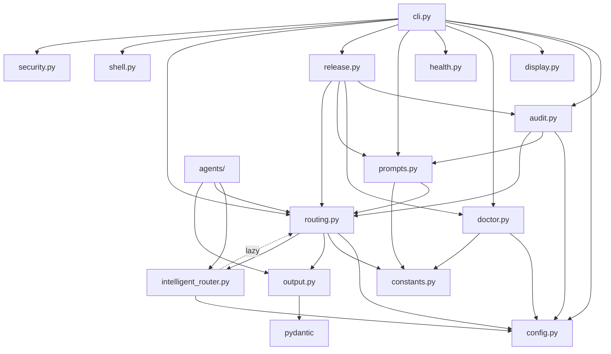

# AI-Harness Developer Guide

## Architecture Overview

AI-Harness is a Python package (`aih/`) with a thin CLI wrapper (`scripts/aih`). The architecture follows a clean layered design:

```
┌─────────────────────────────────────────────────┐
│                   CLI Layer                      │
│               aih/cli.py                         │
│    (argument parsing, command dispatch)           │
├─────────────────────────────────────────────────┤
│              Business Logic                      │
│  ┌──────────┐ ┌──────────┐ ┌──────────────────┐ │
│  │ routing  │ │ prompts  │ │ audit/release    │ │
│  │          │ │          │ │                  │ │
│  └────┬─────┘ └────┬─────┘ └────────┬─────────┘ │
│       │            │                │            │
│  ┌────┴────────────┴────────────────┴──────────┐ │
│  │              Core Services                   │ │
│  │  config, constants, display, doctor,         │ │
│  │  health, security, shell, output             │ │
│  └──────────────────────────────────────────────┘ │
│                                                   │
│  ┌──────────────────────────────────────────────┐ │
│  │           Agent Framework                     │ │
│  │  agents/base.py  agents/manager.py            │ │
│  │  agents/router_agent.py                       │ │
│  └──────────────────────────────────────────────┘ │
└─────────────────────────────────────────────────┘
```

---

## Module Reference

### `aih/__init__.py`
Package root. Exports `__version__`.

### `aih/__main__.py`
Entry point for `python -m aih`.

### `aih/cli.py` (352 lines)
The CLI entry point. Contains:
- **Request parsing**: `read_request()` — reads from args, file, or stdin
- **Overlay construction**: `build_overlay()` — routes the request and creates an `Overlay`
- **Command handlers**: `cmd_do`, `cmd_ask`, `cmd_prompt`, `cmd_route`, `cmd_run`, `cmd_doctor`, `cmd_manifest`, `cmd_validate`, `cmd_release`, `cmd_health`, etc.
- **Display helpers**: `print_completion_summary()`, `print_dry_run_preview()`
- **Parser**: `build_parser()` — defines all subcommands and flags

### `aih/config.py` (180 lines)
Configuration management:
- **`Config` dataclass**: All configuration fields with defaults
- **`_parse_toml()`**: TOML parser with fallback to manual key=value parsing
- **`load_config()`**: Layered config loading from multiple sources
- **`ROOT` resolution**: Auto-detects harness root from env, config, or package location
- **Shared utilities**: `utc_now()`, `read_version()`, `files()`, `match_file()`

### `aih/constants.py` (148 lines)
All shared constants:
- `MODES`: Mode definitions with titles, routes, and keywords
- `CORE_FILES`, `CORE_DIRS`: Files/dirs required by doctor checks
- `SEARCH_DIRS`: Directories searched for harness files
- `SENSITIVE_REQUEST_PATTERNS`: Regex patterns for secret redaction
- `DEEP_REQUEST_TERMS`: Keywords that trigger deep execution
- `ANSI`: ANSI color code mappings
- `RELEASE_GATES`: Production release checklist items
- `SHELL_*`: Shell configuration constants

### `aih/routing.py` (170 lines)
Request routing engine:
- **`Overlay`** (frozen dataclass): Execution context container
- **`classify_mode()`**: Legacy keyword-based mode classification
- **`infer_risk()`**: Risk level detection (high/medium/normal)
- **`choose_target()`**: Target selection (codex/claude/generic)
- **`is_deep_request()`**: Deep execution detection with configurable thresholds
- **`route_intelligently()`**: High-level routing returning `RoutingResult`

### `aih/intelligent_router.py` (31 lines)
LLM-based routing stub:
- **`intelligent_route()`**: Checks config for `router_model`, falls back to `classify_mode()` when model is `"stub"`
- Designed for future LLM API integration without changing callers

### `aih/output.py` (42 lines)
Structured output models:
- **`RoutingResult`** (Pydantic BaseModel): Validated routing decision
- **`format_result()`**: JSON serialization using `model_dump_json()`

### `aih/prompts.py` (203 lines)
Overlay prompt generation:
- **`overlay_clauses()`**: Generates mode/target/risk-specific behavioral clauses
- **`deep_pass_plan()`**: 10-step deep execution plan
- **`deep_execution_block()`**: Full deep execution section with rules
- **`build_prompt()`**: Assembles the complete overlay prompt

### `aih/audit.py` (102 lines)
Audit trail management:
- **`slugify()`**: Safe directory name generation
- **`redact_request()`**: Secret pattern redaction
- **`unique_dated_dir()`**: Collision-free timestamped directory creation
- **`write_run()`**: Full run record writer
- **`append_metadata()`, `read_metadata()`**: Key-value metadata I/O
- **`final_message_summary()`**: Codex response summarization

### `aih/doctor.py` (123 lines)
Health checking and validation:
- **`Check`** (frozen dataclass): Individual check result with status/required/detail
- **`doctor_checks()`**: Runs all health checks
- **`doctor_payload()`**: Serializable doctor report
- **`build_manifest()`**: Public command surface description
- **`run_self_tests()`**: Executes test suite via subprocess
- **`validation_payload()`**: Combined doctor + tests + manifest gate

### `aih/security.py` (150 lines)
Security hardening:
- **`sanitize_request()`**: Input validation (length, empty, shell injection)
- **`validate_api_key()`**: API key structural validation
- **`audit_log()`**: Structured JSON-L audit logging
- **`_JsonFormatter`**: Custom log formatter for machine-readable output
- **`RequestValidationError`**: Custom exception for validation failures
- Shell injection patterns: backticks, `$()`, `${}`, pipe-to-destructive, raw device writes

### `aih/display.py` (46 lines)
Terminal display utilities:
- **`use_color()`**: Auto-detect color support
- **`color()`**: ANSI colorizer with graceful degradation
- **`status_text()`, `verdict_text()`**: Status-aware coloring
- **`print_heading()`, `print_item()`**: Formatted output helpers

### `aih/health.py` (37 lines)
System health snapshots — runs system commands and records output.

### `aih/shell.py` (34 lines)
Zsh configuration for punctuation-safe prompt input.

### `aih/release.py` (98 lines)
Release packet generation — creates a validation packet with doctor report, manifest, test results, and example prompt.

---

## Agent Framework

### `aih/agents/base.py`
- **`Agent`** (ABC): Abstract base class with `run(request: str) -> Any`
- **`AgentError`**: Runtime error for agent failures

### `aih/agents/manager.py`
- **`_AGENT_REGISTRY`**: Maps agent names to classes
- **`get_agent(name)`**: Factory function returning agent instances

### `aih/agents/router_agent.py`
- **`RouterAgent`**: Concrete agent that delegates to `intelligent_route()`
- Supports API key from environment (`AIH_AGENT_API_KEY`) or constructor
- Falls back to stub routing when no LLM is configured

---

## Design Decisions

### 1. Frozen Dataclasses for Immutability
`Overlay` and `Check` use `@dataclass(frozen=True)` to prevent accidental mutation after construction.

### 2. Lazy Imports to Break Circular Dependencies
`intelligent_router.py` imports `classify_mode` inside the function body (not at module level) to break the `routing → intelligent_router → routing` circular import.

### 3. Sentinel Pattern for is_deep_request
`is_deep_request(threshold=None, min_terms=None)` uses `None` sentinels instead of default values. This allows explicit caller overrides to take priority over config-file values.

### 4. Pydantic v2 for Output Validation
`RoutingResult` uses Pydantic `BaseModel` for strict validation and serialization, ensuring API contracts are enforced at runtime.

### 5. Layered Configuration
Config loading follows a priority chain: environment variables → user config → project config → defaults. This allows both global and per-project customization.

### 6. Non-Breaking Hyphen Avoidance
All source files use ASCII hyphens (`-`, U+002D) only. Non-breaking hyphens (U+2011) caused `mypy` syntax errors and are explicitly avoided.

---

## Type Safety

The entire codebase passes `mypy --strict` with zero errors. Key practices:

- All function signatures have explicit return types
- `cast()` is used in CLI command handlers where `dict[str, object]` payloads need iteration
- `from __future__ import annotations` is used in every module for PEP 604 union syntax
- Pydantic models provide runtime type validation for external-facing data

### Running Type Checks

```bash
mypy --strict aih
```

---

## Testing

### Test Structure

```
tests/
├── test_aih.py              # Integration tests (subprocess-based)
├── test_agents.py            # Agent framework tests
├── test_audit.py             # Audit trail tests
├── test_config.py            # Configuration tests
├── test_display.py           # Display/color tests
├── test_doctor.py            # Doctor/manifest tests
├── test_health.py            # Health snapshot tests
├── test_intelligent_router.py # Routing stub tests
├── test_output.py            # Pydantic model tests
├── test_prompts.py           # Prompt generation tests
├── test_routing.py           # Core routing tests
├── test_security.py          # Security/sanitization tests
└── test_shell.py             # Shell config tests
```

### Running Tests

```bash
# Quick run
pytest -q

# With coverage
pytest --cov=aih --cov-report=term-missing

# Single file
pytest tests/test_routing.py -v
```

### Writing Tests

- Use `unittest.TestCase` for consistency with existing tests
- Use `tempfile.TemporaryDirectory()` for filesystem tests
- Use `unittest.mock.patch` for external dependencies
- Save/restore `cfg.ROOT` when tests modify it:
  ```python
  old_root = cfg.ROOT
  cfg.set_root(Path(tmp))
  try:
      # ... test code ...
  finally:
      cfg.set_root(old_root)
  ```

---

## Contributing

### Code Style
- Python 3.10+ syntax (PEP 604 unions, `match` statements allowed)
- Line length: 140 characters (configured in `pyproject.toml`)
- Google-style docstrings
- All public functions must have type annotations and docstrings

### Adding a New Command
1. Add a handler function `cmd_<name>(args: argparse.Namespace) -> None` in `cli.py`
2. Add a subparser in `build_parser()`
3. Add the command name to `build_manifest()` in `doctor.py`
4. Write tests in a new or existing test file
5. Update `docs/USER.md` with usage

### Adding a New Mode
1. Add an entry to `MODES` in `constants.py`:
   ```python
   "mymode": {
       "title": "My Mode",
       "route": "Description of where this routes.",
       "keywords": ("keyword1", "keyword2"),
   },
   ```
2. Add mode-specific clauses in `prompts.py` → `overlay_clauses()`
3. Add tests in `test_routing.py` and `test_prompts.py`

### Adding a New Agent
1. Create `aih/agents/my_agent.py` with a class extending `Agent`
2. Register it in `aih/agents/manager.py` → `_AGENT_REGISTRY`
3. Write tests in `tests/test_agents.py`

### Pre-Commit Checks
```bash
# Type check
mypy --strict aih

# Lint
ruff check aih/

# Tests
pytest -q

# Coverage
pytest --cov=aih --cov-report=term-missing
```

---

## Project Files

| File | Purpose |
|------|---------|
| `pyproject.toml` | Build system, dependencies, tool config |
| `mypy.ini` | Mypy strict mode configuration |
| `.gitignore` | Excludes pycache, coverage, eggs |
| `scripts/aih` | CLI wrapper script |
| `INDEX.md` | Harness file index |
| `HOW_TO_USE.md` | Usage readme |
| `VERSION.md` | Version history |
| `RELEASE_CHECKLIST.md` | Release process |

---

## Dependency Graph



Note: The dotted line from `intelligent_router` to `routing` indicates a **lazy import** (inside function body) to break a circular dependency.
